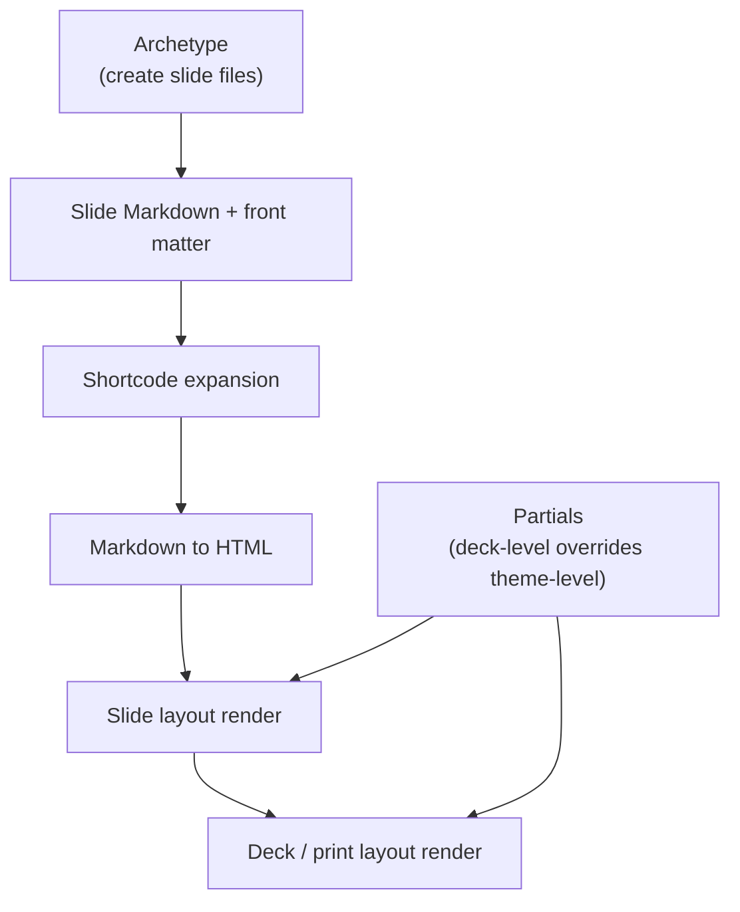

# Margo Authoring Guide

This guide explains how to use the current `margo` prototype to:
- create a new deck
- create new slides and notes
- choose a theme
- pick layouts and archetypes
- embed images, shared assets, and video
- build and preview the deck

This reflects the repo's current implementation, not the long-term product vision.

## 1. Build the CLI

From the repo root:

```bash
go build -o ./bin/margo ./cmd/margo
```

You can also run commands with `go run ./cmd/margo ...`, but using `./bin/margo` is easier once you are working inside deck folders.

## 2. Create a New Deck

Create a new deck in a new directory:

```bash
./bin/margo new my-deck
cd my-deck
```

Initialize a deck in the current directory instead:

```bash
mkdir my-deck
cd my-deck
../bin/margo init
```

The generated deck looks like this:

```text
my-deck/
  AGENTS.md
  .agents/
    README.md
    skills/
      margo-deck-authoring/
      margo-theme-authoring/
      margo-github-pages/
      margo-error-triage/
  margo.yaml
  partials/                     # deck-local reusable template fragments
  shortcodes/                   # deck-local Markdown-facing components
  layouts/                      # reserved; active layouts live in the theme
  slides/
    01-title/index.md
    02-why/index.md
  themes/
    default/
  archetypes/
    default/
    title/
    section/
    agenda/
    image/
    two-column/
    media-left/
    media-right/
    quote/
    metric/
    closing/
  assets/
```

### Agent guidance and deck skills

New decks include `AGENTS.md` and repository-local skills under `.agents/skills/`. These files travel with a portable `.margo` deck archive, so an agent working from a handoff can use the same deck conventions and command reference.

`AGENTS.md` contains the rules that always apply: keep slide content in Markdown bundles, keep presentational composition in themes, use `margo.yaml` as the configuration entry point, and do not edit generated `dist/` output.

The scaffold includes five documentation-only skills:

- `margo-deck-authoring` for slide content, front matter, assets, notes, builds, safe scaffold upgrades, and complete deck packaging.
- `margo-theme-authoring` for layouts, partials, shortcodes, theme assets, theme installation, and `.margot` theme transfer.
- `margo-github-pages` for GitHub Pages setup, generated workflow review, release-tag deployment, and manual dispatch.
- `margo-error-triage` for reported build, preview, rendering, and export failures. It gathers evidence, identifies whether the deck, theme, Margo, or the local environment owns the problem, and requires approval before any change or external report.
- `margo-brand-theme` for evidence-backed brand-theme creation, with a mandatory design-direction approval gate before theme files change.

The skills contain no executable scripts or external-service dependencies. Customize the generated guidance for deck-specific conventions, but keep the command reference aligned with the installed Margo version.

### Brand-theme skill

Every new deck includes `margo-brand-theme`, a project-local skill for turning approved brand guidelines, websites, and visual references into an editable Margo theme. It requires a machine-readable component contract and explicit review of the proposed visual direction before changing theme files. It audits inherited theme styling, verifies branded selectors against rendered markup, records evidence authority and asset rights separately, and validates HTML, PDF, and PPTX separately.

Install the complete user-global version when you want the same workflow available across Margo decks:

```bash
margo skills install brand-theme --scope user
```

Use `--scope project` to install the deck-local version in an existing project, or `--plan` to inspect safe additions, updates, and preserved custom files. The user-global skill is named `brand-to-margo-theme`; the project-local skill is named `margo-brand-theme` so Codex can distinguish them.

There is no separate upgrade skill. Upgrade is a guarded maintenance action inside normal deck ownership, so `margo-deck-authoring` owns it. GitHub Pages is a distinct external publishing workflow, so it has its own narrowly scoped skill.

### Upgrade an older project

Use the upgrade planner before applying a scaffold refresh:

```bash
margo upgrade --plan
margo upgrade --apply
```

Margo updates agent guidance and untouched theme scaffold files that match its
recorded scaffold baseline, and adds missing guidance files. It preserves
customized guidance, slides, configuration, customized theme files, assets, and
generated output. Before replacing an untouched managed file, it saves the
prior file under `.margo-backups/`.
Projects created before scaffold manifests receive a conservative additive
upgrade: existing files remain untouched, while missing agent resources and a
new `.margo/scaffold-manifest.yaml` are added.

### Publish to GitHub Pages

From a Margo deck inside a Git repository, create a transparent GitHub Actions
workflow with:

```bash
margo deploy github-pages --margo-version v0.3.0
```

This writes `.github/workflows/margo-pages.yml` and `.nojekyll`. The workflow
publishes the HTML deck on pushes of `v*` tags and supports manual dispatch.
It pins the Margo release specified by `--margo-version`; use the version your
deck has been verified against. Commit the generated files, push them, then
set the repository’s Pages source to **GitHub Actions** in GitHub settings.
Use `--replace` only when you intentionally want to replace Margo’s generated
workflow. Custom domains remain a GitHub Pages repository setting.

## 3. Understand `margo.yaml`

The root config file controls deck metadata, theme choice, and outputs.

Example:

```yaml
version: 1

deck:
  title: My Deck
  description: Internal review
  language: en
  logo: MARGO
  footer: Internal Strategy Review

theme:
  name: default
  color_mode: light
  typography: editorial
  accent_color: "#8f6f33"

outputs:
  html: true
  pdf: true
  png: false
  pptx: false
```

### Current default-theme options

The built-in `default` theme currently supports:
- `color_mode`: `light` or `dark`
- `typography`: theme preset, currently `editorial` or `executive`
- `accent_color`: any CSS color string

If you provide an unsupported value such as `color_mode: sepia`, `margo build` now fails with a theme option validation error that lists the allowed values.

To switch the deck to dark mode:

```yaml
theme:
  name: default
  color_mode: dark
  typography: executive
  accent_color: "#4db6ac"
```

### Logo support

In the current default theme, `deck.logo` supports either:
- plain text
- a shared deck asset path such as `assets/company-logo.svg`

Text logo example:

```yaml
deck:
  logo: MARGO
```

Image logo example:

```yaml
deck:
  logo: assets/company-logo.svg
```

The default theme will render text directly, or render an `` when the value resolves to a shared image asset.

### Deck-level snippets

The current config also supports approved deck-level snippet slots:

```yaml
snippets:
  head: |
    <meta name="analytics-env" content="staging">
  body_end: |
    <script>window.__deckMode = "preview";</script>
```

Current supported locations:
- `snippets.head`
- `snippets.body_end`

These are injected into both `serve` and `build` output in the default theme.

## 4. Preview and Build

Build the configured outputs:

```bash
../bin/margo build
```

Preview locally:

```bash
../bin/margo serve
```

`margo serve` uses `127.0.0.1:1313` by default. If that port is already in use:
- interactive runs prompt for another port
- non-interactive runs should pass `--port <port>`

Useful variants:

```bash
../bin/margo build --include-drafts
../bin/margo serve --no-open
../bin/margo serve --port 1414
../bin/margo clean
```

Current output locations:
- `dist/html/index.html`
- `dist/pdf/deck.pdf` when PDF is enabled and local Chrome works
- `dist/png/` with one 1920x1080 PNG per included slide when PNG is enabled and local Chrome works
- `dist/pptx/deck.pptx` when PPTX is enabled

PPTX export produces editable text, headings, lists, images, and speaker notes. Shortcodes and other web-native content that cannot map cleanly to PowerPoint are omitted with a build diagnostic. HTML and PDF output remain unchanged.

To bootstrap or inspect a theme’s PPTX contract:

```bash
../bin/margo theme pptx init default
../bin/margo theme pptx inspect default
../bin/margo theme pptx validate default
```

The optional contract lives at `themes/<name>/pptx/theme.yaml`. It declares PowerPoint-specific fonts, colors, assets, and layout metadata while the HTML theme remains unchanged.

Layout geometry is expressed in inches. For example:

```yaml
layouts:
  media-right:
    name: media-right
    image_position: right
    image_width: 5.5
    image_height: 3.2
    body_x: 0.8
    body_y: 1.7
    body_width: 6.2
```

### Portable project archives

Use a `.margo` archive to hand an editable deck to another Margo user. It contains the deck source, vendored themes, assets, archetypes, and shortcodes, but excludes generated output, Git data, caches, and backups.

```bash
margo pack /path/to/my-deck
# writes /path/to/my-deck.margo

margo unpack /path/to/my-deck.margo restored-deck

margo /path/to/my-deck.margo --port 1414
```

The last command extracts to a temporary workspace for the current run, builds, and serves the deck. Changes made there are discarded when the server stops, so use `unpack` before editing. Margo rejects unsafe archive paths, symlinks, oversized archives, and non-empty unpack destinations. Do not open `.margo` files from untrusted sources: local theme templates and shortcodes execute trusted project logic.

## 5. Create New Slides

From inside a deck:

```bash
../bin/margo new slide roadmap
```

If you do not pass an archetype, `margo` will prompt you to choose one interactively.

Create a slide with a specific archetype:

```bash
../bin/margo new slide roadmap --archetype agenda
../bin/margo new slide hero --archetype image
../bin/margo new slide split --archetype two-column
../bin/margo new slide customer --archetype media-right
../bin/margo new slide architecture --archetype media-left
../bin/margo new slide north-star --archetype metric
../bin/margo new slide quote --archetype quote
../bin/margo new slide close --archetype closing
```

### Insert and reorder slides

Use `slide insert` to place a new slide without manually changing every later
slide's order:

```bash
../bin/margo slide insert roadmap --after 02-why --archetype agenda
../bin/margo slide insert strategy --before 03-roadmap
../bin/margo slide insert close --position 8 --archetype closing
```

Choose exactly one placement selector: `--before <slide-bundle>`, `--after
<slide-bundle>`, or the one-based `--position <n>`. Margo updates each slide's
front matter `order`, and rewrites `manifest.yaml` when the deck uses one.

If every existing slide bundle uses a positional name such as `01-title`, Margo
also renames the affected bundles to keep those prefixes contiguous. It prints
the resulting rename map and preserves all files inside each bundle, including
notes and assets. For a deck with arbitrary descriptive bundle names, Margo
keeps those paths stable and only updates sequence metadata. Pass `--renumber`
to explicitly rename such a deck into positional bundle names.

### Move or delete a slide

Move a slide to a new position with the same placement selectors:

```bash
../bin/margo slide move 12-market-size --after 04-product
../bin/margo slide move 12-market-size --before 01-title
../bin/margo slide move 12-market-size --position 5
```

Delete a slide bundle with:

```bash
../bin/margo slide delete 04-product
```

Margo will not delete the last remaining slide. It moves deleted bundles,
including all assets and notes, to `.margo-trash/<timestamp>/` at the deck
root. The remaining slides are resequenced and a positional deck is renumbered
automatically. Use `--renumber` when you also want to rename a descriptive-name
deck.

Each slide is a bundle:

```text
slides/<slide-id>/index.md
```

You can place slide-local assets beside `index.md`.

## 6. Slide Front Matter

A typical slide starts like this:

```yaml
---
title: Why Margo
order: 2
layout: content
section: Strategy
footer_text: Product Strategy
background:
  color: "#fbf6ec"
  image: backdrop.svg
  overlay: "linear-gradient(180deg, rgba(255,255,255,0.24), rgba(255,255,255,0))"
  opacity: 1
image_hints:
  fit: contain
  position: center
  caption: Authoring and output model overview
notes:
  - Mention Hugo mental model
  - Emphasize HTML-first output
---
```

### Current standardized slide fields

- `title`
- `order`
- `section`
- `layout`
- `type`
- `draft`
- `visibility`
- `hide_logo`
- `hide_footer`
- `footer_text`
- `background`
- `image_hints`
- `notes`

### Drafts and visibility

```yaml
draft: true
visibility: hidden
```

Current behavior:
- `serve` includes drafts and marks them visibly
- `build` excludes drafts unless `--include-drafts` is used
- `visibility: hidden` slides are excluded from normal output

### Notes

Put named note files in a slide bundle's `notes/` directory:

```text
slides/02-why/
  index.md
  notes/
    research.md
    speaker-script.md
    sources.md
```

Notes may remain plain Markdown for backward compatibility. In that case, Margo derives the note ID and selectable HTML label from its filename. For example, `speaker-script.md` becomes `speaker-script` and “Speaker script.”

Use optional front matter when the note needs a stable ID, display title, explicit ordering, or lifecycle metadata:

```md
---
id: speaker-script
title: Speaker script
order: 10
visibility: visible
draft: false
kind: speaker_script
tags:
  - internal
language: en
---

Open with the customer story.
```

Supported fields are `id`, `title`, `order`, `visibility` (`visible` or `hidden`), `draft`, `kind`, `tags`, and `language`. IDs must be unique within a slide bundle. Hidden notes are omitted from generated HTML; draft notes appear in `serve` but are excluded from a normal `build`.

Create a note scaffold with:

```bash
margo new note speaker-script --slide 02-why
```

Enable note controls explicitly in `margo.yaml`:

```yaml
presentation:
  navigation:
    notes: true
```

The HTML deck always includes Previous and Next controls. When notes are enabled, the current slide shows a Notes button only when it has note files or legacy notes. Clicking it reveals the selected note beneath the slide. Notes are excluded from print HTML and PDF output.

For an unmodified deck made with the earlier default scaffold, run this migration from a checkout of the current Margo repository:

```bash
python3 scripts/migrate-default-theme-notes.py /path/to/your/deck
```

It backs up `margo.yaml`, `themes/default/layouts/deck.html`, and `themes/default/assets/theme.css` under `.margo-backups/`. It deliberately refuses custom or modified themes, which need a manual merge of the current default-theme controls.

Margo also preserves legacy notes in front matter:

```yaml
notes:
  - Open with the customer story
  - Do not over-explain PDF export yet
```

Or in a body section:

```md
## Notes

Mention the Hugo mental model.
```

Legacy notes and body note sections become the default “Notes” bucket. They remain excluded from normal slide content.

## 7. Choose a Layout or Archetype

In practice, archetypes and layouts are closely related in the current prototype.

### Built-in archetypes in the scaffold

- `default`
- `title`
- `section`
- `agenda`
- `image`
- `two-column`
- `media-left`
- `media-right`
- `quote`
- `metric`
- `closing`

### Current layout names

These are the layout names used by the default theme:

- `content`
- `title`
- `section`
- `agenda`
- `image`
- `two-column`
- `media-left`
- `media-right`
- `quote`
- `metric`
- `closing`

If you want to switch a slide manually:

```yaml
layout: media-right
```

### Layout guidance

- `content`: general-purpose text/content slide
- `title`: opening slide
- `section`: divider slide
- `agenda`: ordered list of topics
- `image`: visual-first slide
- `two-column`: split text or mixed content, usually driven by a `<!-- column-break -->` marker
- `media-left` / `media-right`: media-and-copy compositions provided by the theme template
- `quote`: pull quote with attribution
- `metric`: single KPI slide
- `closing`: thank-you or wrap-up slide

## 8. Embed Images

### Slide-local images

Put the image in the same slide bundle:

```text
slides/02-why/
  index.md
  diagram.svg
```

Reference it in Markdown:

```md

```

Reference it in background front matter:

```yaml
background:
  image: diagram.svg
```

### Shared deck assets

Put reusable assets under the deck-level `assets/` directory:

```text
assets/
  shared-grid.svg
  video-poster.svg
```

Reference them from slides:

```md

```

Or from front matter:

```yaml
background:
  image: assets/shared-grid.svg
```

Current behavior:
- slide-local assets are staged into `dist/html/slides/<slide-id>/...`
- shared assets are staged into `dist/html/assets/...`

## 9. Control Backgrounds and Image Presentation

### Background treatment

```yaml
background:
  color: "#101820"
  image: backdrop.svg
  overlay: "linear-gradient(180deg, rgba(0,0,0,0.22), rgba(0,0,0,0.55))"
  opacity: 1
```

### Image hints

```yaml
image_hints:
  fit: contain
  position: center
  caption: Architecture overview
```

Current supported image hints in the default theme:
- `fit`
- `position`
- `caption`

## 10. Use Shortcodes

The current default theme ships with theme-provided shortcodes.

### Callout

```md

Theme-provided shortcodes make expressive slides possible without abandoning Markdown.

```

### Columns

```md


### Authoring

- Markdown
- Front matter
- Archetypes


### Output

- HTML first
- PDF next
- Editable PPTX export


```

### Stat

```md

```

### Video

```md

```

Current `video` behavior:
- `src` may be an external URL or local asset path
- `poster` may be a slide-local or deck-level asset path

### Figure

```md

```

Current `figure` behavior:
- `src` must resolve to a slide-local or deck-level asset path
- `alt` is required
- `caption` is optional
- `credit` is optional and renders as secondary attribution text
- `width` sets a maximum rendered width for the figure block
- `fit` supports `contain` or `cover`
- `position` maps to CSS `object-position` for the image
- `link` optionally wraps the image in an anchor

### Columns

The default-inspired theme includes responsive `columns` and `column` shortcodes. Set a relative width on a column when one side should be wider. Columns without an explicit width divide the remaining space equally.

```md


Main content


Supporting content


```

Current `column` behavior:
- `width` accepts a percentage from `0%` to `100%`
- unspecified columns share the remaining width
- `font-size` accepts a percentage relative to the surrounding theme typography
- column text, lists, captions, and table cells inherit the column font size
- columns stack at narrow layouts and reset width constraints
- existing columns without parameters retain the equal-width behavior

Explicit widths should normally total no more than 100%. If they exceed the available space, flexbox shrinks the sized columns to prevent overflow. The default implementation is static and works in interactive HTML and print output. It does not provide a browser drag handle.

### Mermaid

```md

flowchart LR
  A[Markdown] --> B[Build]
  B --> C[HTML]
  B --> D[PDF]

```

Current `mermaid` behavior:
- Mermaid source lives in the shortcode inner content
- `caption` is optional
- `align` supports `left`, `center`, or `right`
- generated HTML renders a readable source fallback first, then upgrades it to a Mermaid diagram in the browser when the Mermaid runtime loads

### Chart

```md

type: line
data:
  labels: ["Q1", "Q2", "Q3", "Q4"]
  datasets:
    - label: "Active brokers"
      data: [12, 18, 27, 35]
      borderColor: "#4db6ac"
      tension: 0.3
options:
  plugins:
    legend:
      display: true

```

Current `chart` behavior:
- chart configuration lives in the shortcode inner content as YAML
- `caption`, `class`, `height`, `width`, and `id` are optional shortcode params
- supported chart types in the first version are `bar`, `line`, `pie`, `doughnut`, and `radar`
- generated HTML renders a readable configuration fallback first, then upgrades it to a Chart.js canvas in the browser when the Chart.js runtime loads

### Math

```md

\operatorname{Var}(X) = \mathbb{E}[X^2] - \left(\mathbb{E}[X]\right)^2

```

Current `math` behavior:
- block math lives in the shortcode inner content as TeX
- `caption` and `class` are optional shortcode params
- the first version supports block math only, not inline math inside prose
- generated HTML renders a readable TeX fallback first, then upgrades it to KaTeX output in the browser when the local KaTeX runtime loads

### GitHub Repo

```md

```

Current `github-repo` behavior:
- `repo` is required and must use `owner/name`
- `caption` is optional
- generated HTML renders a static, styled repo card with a direct GitHub link
- no GitHub API call is made in the first version

### Deck-local shortcodes

The scaffold also creates a deck-local shortcode at:

```text
shortcodes/eyebrow.html
```

Example use:

```md

```

## 11. Reuse Project-Local Markdown with Includes

`margo` supports explicit project-local Markdown includes.

Supported syntax:

```md

```

Current rules:
- include paths are project-local
- include paths may not escape the project root
- includes are expanded before normal Markdown rendering
- nested includes work
- include cycles are rejected with a clear error

Example project structure:

```text
my-deck/
  shared/
    authoring.md
    output.md
  slides/
    02-why/index.md
```

Example slide usage:

```md








```

This keeps repeated Markdown content in one place without introducing a parameterized content system.

## 12. Create or Choose a Theme

### Use the default theme

Every scaffolded deck starts with:

```yaml
theme:
  name: default
```

The default theme now supports two viewing modes from the same generated HTML:
- desktop keeps the fixed-stage presentation view
- narrow screens switch to a mobile reading/paging mode with touch scrolling and slide dots

### Create a new theme

From inside a deck:

```bash
../bin/margo new theme custom
```

That creates a default-inspired theme scaffold under:

```text
themes/custom/
```

### Create a blank theme

```bash
../bin/margo new theme minimalist --blank
```

### Install a vendored theme from Git

From inside a deck:

```bash
../bin/margo theme add https://example.com/brand-theme.git --ref v0.1.0
```

The first implementation installs the theme directly into the deck-local `themes/` directory and records the Git source in `theme.yaml`.

Useful variants:

```bash
../bin/margo theme add https://example.com/brand-theme.git --name brand
../bin/margo theme update brand
../bin/margo theme list
```

### Package and import one theme

Use a `.margot` archive to hand over one theme without a Git repository or network access. A `.margot` archive contains only the chosen theme. It is not a runnable deck and is different from a `.margo` project archive.

From a source deck, select the theme to package. This selection is required when the command is not interactive, even if the deck contains only one theme:

```bash
../bin/margo theme pack brand
# writes ../brand.margot by default

../bin/margo theme pack --theme brand --output /path/to/brand-v1.2.0.margot
```

If the selector is omitted in an interactive terminal, Margo lists the deck's themes and asks you to choose one. It never packages every theme in the source deck.

From the receiving deck, import the archive:

```bash
../bin/margo theme import /path/to/brand-v1.2.0.margot
../bin/margo theme import /path/to/brand-v1.2.0.margot --name client-brand --activate
```

Import installs a complete copy under `themes/<name>/` and validates it before making it available. It does not change the active theme unless you provide `--activate`. It refuses to overwrite an existing theme. Use `--name` to choose a free local name.

Margo records the archive checksum and imported version in `theme.yaml`. An imported theme builds offline, even after the archive is deleted. It cannot be updated with `margo theme update`; import a newer archive or install the maintained Git theme instead.

Do not import `.margot` files from untrusted sources. Theme templates, shortcodes, and JavaScript execute as trusted project logic during local builds and previews.

### Switch themes

Edit `margo.yaml`:

```yaml
theme:
  name: custom
```

Current rule: one active theme per deck.

## 13. Edit Theme Layouts

The default theme uses:

```text
themes/default/theme.yaml
themes/default/assets/theme.css
themes/default/layouts/deck.html
themes/default/layouts/slide-default.html
themes/default/layouts/slide-title.html
themes/default/layouts/slide-section.html
themes/default/layouts/slide-agenda.html
themes/default/layouts/slide-image.html
themes/default/layouts/slide-two-column.html
themes/default/layouts/slide-media-left.html
themes/default/layouts/slide-media-right.html
themes/default/layouts/slide-quote.html
themes/default/layouts/slide-metric.html
themes/default/layouts/slide-closing.html
themes/default/partials/*.html
themes/default/shortcodes/*.html
```

The easiest way to customize appearance today is:
1. create a new theme scaffold
2. point `margo.yaml` at it
3. edit the theme's `layouts/`, `partials/`, `assets/`, and `shortcodes/`

For ordinary content slides, the default theme now standardizes around a simple region contract:

- `chrome`: logo, slide number, footer text
- `header`: section label or eyebrow plus title
- `context`: optional subtitle, intro, or breadcrumb
- `body`: the dominant content composition for the slide
- `annotations`: caption, source, or side note
- `footer`: persistent deck metadata

In practice, that means the default theme favors reusable partials such as `slide-header` and `slide-annotations`, while shared styling lives in `themes/<name>/assets/theme.css` instead of being repeated inline across every layout.

Current partial rules:
- deck-local partials may be added under `partials/*.html`
- theme partials may be added under `themes/<name>/partials/*.html`
- deck-local partials override theme partials by name
- templates can render them with standard Go template calls such as `{{ template "deck-logo" . }}`

Deck-local partials live at the project root:

```text
partials/<name>.html
```

They are reusable Go template fragments called by a layout or shortcode. They are not invoked directly from Markdown. Use a deck-local shortcode when authors need a Markdown-facing entry point.

Theme partials live inside the active theme:

```text
themes/<theme-name>/partials/<name>.html
```

When both locations contain the same partial name, the deck-local partial in `partials/` overrides the theme partial. Keep the fragment's markup in the partial and its styling in the active theme CSS.

The root `layouts/` directory is reserved in the current authoring model. Put active slide and deck layouts under `themes/<theme-name>/layouts/`.

### Styles for deck-local shortcodes and partials

If a shortcode or partial is specific to this deck, keep its styles with the deck rather than adding them to the theme:

```text
assets/css/<component>.css
```

Margo stages files under the deck-level `assets/` directory into build output, but the current version does not bundle or automatically discover CSS files. Add an explicit stylesheet link from the active theme's deck layout when the CSS is shared or substantial:

```html
<link rel="stylesheet" href="assets/css/stat-stack.css">
```

For a small component used only in one place, a scoped `<style>` block inside the shortcode template is acceptable. Keep theme CSS for components that are part of the theme's reusable visual contract. Do not put styles for a deck-local shortcode into `themes/<theme-name>/assets/theme.css` merely because its markup is rendered inside the theme.

## 14. How Archetypes, Shortcodes, Layouts, And Partials Fit Together

These parts operate at different stages:

- **Archetypes** are authoring-time scaffolds used by `margo new slide`
- **Shortcodes** are content components expanded inside slide Markdown
- **Layouts** are render-time templates for slides and deck shells
- **Partials** are reusable template fragments used by layouts

Simple render pipeline:



Current interplay:

- archetypes help create `slides/<id>/index.md`, then they are no longer part of rendering
- shortcodes run before Markdown is turned into HTML
- slide layouts wrap rendered slide body content
- deck and print layouts wrap the full slide collection
- partials can be called from slide, deck, or print templates using standard Go template calls such as `{{ template "deck-logo" . }}`
- layout-specific composition should stay in templates; the Go layer exposes generic helpers rather than named layout behavior

Current override model:

- deck-local shortcodes override theme shortcodes
- deck-local partials override theme partials

Current design principle:

- keep parsing, validation, asset resolution, and model shaping in Go
- keep markup shape, class composition, and template structure in layouts, partials, and shortcodes

## 15. Markdown-first authoring rule

Slide bodies are meant to be authored in Markdown. Keep them readable as content, not as generated HTML. Use this order when deciding where a feature belongs:

1. Markdown for ordinary slide content and structure.
2. An existing shortcode for a supported visual component.
3. A new deck-local shortcode for a reusable, named component. Put the wrapper markup in `shortcodes/<name>.html`; use a partial when the shortcode or a layout needs to reuse a template fragment.
4. A focused layout under `themes/<active-theme>/layouts/` for a larger slide shell or a genuinely one-off composition. Select it with `layout:` in front matter. This keeps one-off work local to the deck without changing the Margo engine or a shared installed theme.
5. Minimal raw HTML only when the previous options cannot express the requirement.

For example, keep a text-and-image slide like this:

```md
- **Institutional products have moved on-chain.** Major asset managers are extending regulated cash products with blockchain-enabled access.
- **The benefits are operational.** Better records, lower reconciliation burden, fractional access, and programmable lifecycle operations.
- **The legal perimeter is clearer.** Tokenized securities remain securities.
- **The local market is modernizing.** PSE product initiatives include Global Philippine Depositary Receipts; StratBox is a controlled testing path.


```

If the grid composition will recur, create a named shortcode such as `refresh-slide-grid` and let its template own the wrapper, classes, and calls to any partials. Keep the visual rules in the active theme CSS. Do not repeat a large nested `<div>` structure in each slide.

The practical Hugo-inspired distinction is:

- Markdown is the content layer.
- Shortcodes are the Markdown-facing API for reusable special-purpose components.
- Partials are reusable template fragments called by layouts or shortcodes, not directly from Markdown.
- Layouts own the larger slide or deck shell and recurring composition.

This separation lets a theme or shortcode evolve its markup and styling without a search-and-replace pass through every slide.

## 16. Common Authoring Patterns

### Standard content slide

```yaml
---
title: Product Strategy
order: 4
layout: content
section: Strategy
---
```

### Explicit section divider slide

```bash
../bin/margo new slide strategy --archetype section
```

### Two-column slide

```md
## What changed

- Faster builds
- Better layouts

<!-- column-break -->

## What is next

- Theme options
- PDF refinement
```

### Media split slide

For `media-left` or `media-right`, author the slide with the lead image first and the remaining content after it. The default theme composes that structure into the final media-and-copy layout:

```md


## Customer Story

- Clearer authoring flow
- Better visual system
- Shared brand assets
```

## 16. Known Current Limitations

This guide reflects the current prototype. Important limitations:

- PDF depends on a local Chrome/Chromium-compatible browser and may fail in restricted remote environments
- PPTX export supports the core editable content model; advanced web-native shortcodes may require fallback handling
- presenter mode is not implemented
- theme APIs and project conventions may still evolve
- browser auto-refresh is currently wired through the scaffolded default theme

## 17. Good Files to Study

If you want real working examples, start with:

- [examples/reference-deck/margo.yaml](../examples/reference-deck/margo.yaml)
- [examples/reference-deck/slides/02-why/index.md](../examples/reference-deck/slides/02-why/index.md)
- [examples/reference-deck/themes/default/theme.yaml](../examples/reference-deck/themes/default/theme.yaml)
- [examples/reference-deck/themes/default/layouts/deck.html](../examples/reference-deck/themes/default/layouts/deck.html)
- [examples/benchmark-deck](../examples/benchmark-deck)
