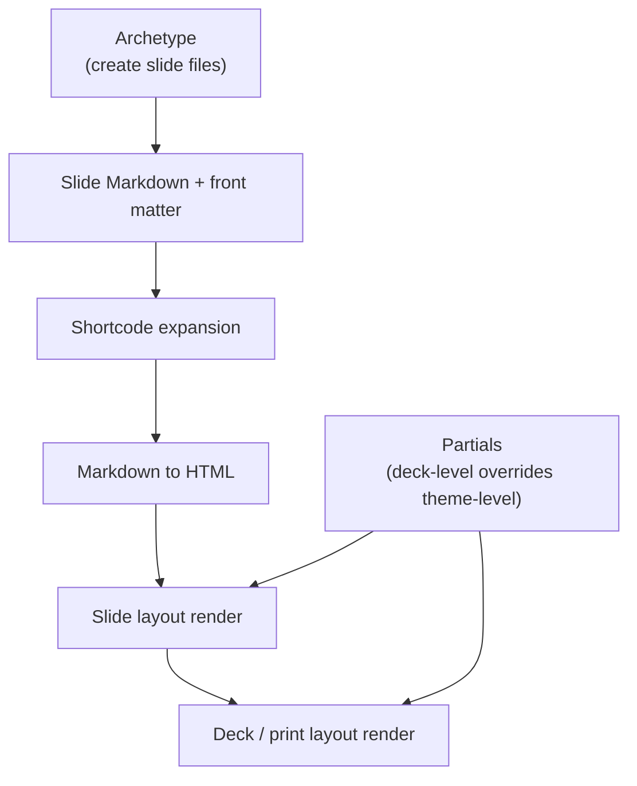

# Margo Authoring Guide

This guide explains how to use the current `margo` prototype to:
- create a new deck
- create new slides
- choose a theme
- pick layouts and archetypes
- embed images, shared assets, and video
- build and preview the deck

This reflects the repo's current implementation, not the long-term product vision.

## 1. Build the CLI

From the repo root:

```bash
go build -o ./bin/margo ./cmd/margo
```

You can also run commands with `go run ./cmd/margo ...`, but using `./bin/margo` is easier once you are working inside deck folders.

## 2. Create a New Deck

Create a new deck in a new directory:

```bash
./bin/margo new my-deck
cd my-deck
```

Initialize a deck in the current directory instead:

```bash
mkdir my-deck
cd my-deck
../bin/margo init
```

The generated deck looks like this:

```text
my-deck/
  margo.yaml
  slides/
    01-title/index.md
    02-why/index.md
  themes/
    default/
  archetypes/
    default/
    title/
    section/
    agenda/
    image/
    two-column/
    media-left/
    media-right/
    quote/
    metric/
    closing/
  assets/
  shortcodes/
```

## 3. Understand `margo.yaml`

The root config file controls deck metadata, theme choice, and outputs.

Example:

```yaml
version: 1

deck:
  title: My Deck
  description: Internal review
  language: en
  logo: MARGO
  footer: Internal Strategy Review

theme:
  name: default
  color_mode: light
  typography: editorial
  accent_color: "#8f6f33"

outputs:
  html: true
  pdf: true
```

### Current default-theme options

The built-in `default` theme currently supports:
- `color_mode`: `light` or `dark`
- `typography`: theme preset, currently `editorial` or `executive`
- `accent_color`: any CSS color string

If you provide an unsupported value such as `color_mode: sepia`, `margo build` now fails with a theme option validation error that lists the allowed values.

To switch the deck to dark mode:

```yaml
theme:
  name: default
  color_mode: dark
  typography: executive
  accent_color: "#4db6ac"
```

### Logo support

In the current default theme, `deck.logo` supports either:
- plain text
- a shared deck asset path such as `assets/company-logo.svg`

Text logo example:

```yaml
deck:
  logo: MARGO
```

Image logo example:

```yaml
deck:
  logo: assets/company-logo.svg
```

The default theme will render text directly, or render an `` when the value resolves to a shared image asset.

### Deck-level snippets

The current config also supports approved deck-level snippet slots:

```yaml
snippets:
  head: |
    <meta name="analytics-env" content="staging">
  body_end: |
    <script>window.__deckMode = "preview";</script>
```

Current supported locations:
- `snippets.head`
- `snippets.body_end`

These are injected into both `serve` and `build` output in the default theme.

## 4. Preview and Build

Build the configured outputs:

```bash
../bin/margo build
```

Preview locally:

```bash
../bin/margo serve
```

`margo serve` uses `127.0.0.1:1313` by default. If that port is already in use:
- interactive runs prompt for another port
- non-interactive runs should pass `--port <port>`

Useful variants:

```bash
../bin/margo build --include-drafts
../bin/margo serve --no-open
../bin/margo serve --port 1414
../bin/margo clean
```

Current output locations:
- `dist/html/index.html`
- `dist/pdf/deck.pdf` when PDF is enabled and local Chrome works

## 5. Create New Slides

From inside a deck:

```bash
../bin/margo new slide roadmap
```

If you do not pass an archetype, `margo` will prompt you to choose one interactively.

Create a slide with a specific archetype:

```bash
../bin/margo new slide roadmap --archetype agenda
../bin/margo new slide hero --archetype image
../bin/margo new slide split --archetype two-column
../bin/margo new slide customer --archetype media-right
../bin/margo new slide architecture --archetype media-left
../bin/margo new slide north-star --archetype metric
../bin/margo new slide quote --archetype quote
../bin/margo new slide close --archetype closing
```

Each slide is a bundle:

```text
slides/<slide-id>/index.md
```

You can place slide-local assets beside `index.md`.

## 6. Slide Front Matter

A typical slide starts like this:

```yaml
---
title: Why Margo
order: 2
layout: content
section: Strategy
footer_text: Product Strategy
background:
  color: "#fbf6ec"
  image: backdrop.svg
  overlay: "linear-gradient(180deg, rgba(255,255,255,0.24), rgba(255,255,255,0))"
  opacity: 1
image_hints:
  fit: contain
  position: center
  caption: Authoring and output model overview
notes:
  - Mention Hugo mental model
  - Emphasize HTML-first output
---
```

### Current standardized slide fields

- `title`
- `order`
- `section`
- `layout`
- `type`
- `draft`
- `visibility`
- `hide_logo`
- `hide_footer`
- `footer_text`
- `background`
- `image_hints`
- `notes`

### Drafts and visibility

```yaml
draft: true
visibility: hidden
```

Current behavior:
- `serve` includes drafts and marks them visibly
- `build` excludes drafts unless `--include-drafts` is used
- `visibility: hidden` slides are excluded from normal output

### Notes

Notes can live in front matter:

```yaml
notes:
  - Open with the customer story
  - Do not over-explain PDF export yet
```

Or in a body section:

```md
## Notes

Mention the Hugo mental model.
```

Notes are preserved in the model but excluded from normal slide HTML.

## 7. Choose a Layout or Archetype

In practice, archetypes and layouts are closely related in the current prototype.

### Built-in archetypes in the scaffold

- `default`
- `title`
- `section`
- `agenda`
- `image`
- `two-column`
- `media-left`
- `media-right`
- `quote`
- `metric`
- `closing`

### Current layout names

These are the layout names used by the default theme:

- `content`
- `title`
- `section`
- `agenda`
- `image`
- `two-column`
- `media-left`
- `media-right`
- `quote`
- `metric`
- `closing`

If you want to switch a slide manually:

```yaml
layout: media-right
```

### Layout guidance

- `content`: general-purpose text/content slide
- `title`: opening slide
- `section`: divider slide
- `agenda`: ordered list of topics
- `image`: visual-first slide
- `two-column`: split text or mixed content, usually driven by a `<!-- column-break -->` marker
- `media-left` / `media-right`: media-and-copy compositions provided by the theme template
- `quote`: pull quote with attribution
- `metric`: single KPI slide
- `closing`: thank-you or wrap-up slide

## 8. Embed Images

### Slide-local images

Put the image in the same slide bundle:

```text
slides/02-why/
  index.md
  diagram.svg
```

Reference it in Markdown:

```md

```

Reference it in background front matter:

```yaml
background:
  image: diagram.svg
```

### Shared deck assets

Put reusable assets under the deck-level `assets/` directory:

```text
assets/
  shared-grid.svg
  video-poster.svg
```

Reference them from slides:

```md

```

Or from front matter:

```yaml
background:
  image: assets/shared-grid.svg
```

Current behavior:
- slide-local assets are staged into `dist/html/slides/<slide-id>/...`
- shared assets are staged into `dist/html/assets/...`

## 9. Control Backgrounds and Image Presentation

### Background treatment

```yaml
background:
  color: "#101820"
  image: backdrop.svg
  overlay: "linear-gradient(180deg, rgba(0,0,0,0.22), rgba(0,0,0,0.55))"
  opacity: 1
```

### Image hints

```yaml
image_hints:
  fit: contain
  position: center
  caption: Architecture overview
```

Current supported image hints in the default theme:
- `fit`
- `position`
- `caption`

## 10. Use Shortcodes

The current default theme ships with theme-provided shortcodes.

### Callout

```md

Theme-provided shortcodes make expressive slides possible without abandoning Markdown.

```

### Columns

```md


### Authoring

- Markdown
- Front matter
- Archetypes


### Output

- HTML first
- PDF next
- PPTX later


```

### Stat

```md

```

### Video

```md

```

Current `video` behavior:
- `src` may be an external URL or local asset path
- `poster` may be a slide-local or deck-level asset path

### Figure

```md

```

Current `figure` behavior:
- `src` must resolve to a slide-local or deck-level asset path
- `alt` is required
- `caption` is optional
- `credit` is optional and renders as secondary attribution text
- `width` sets a maximum rendered width for the figure block
- `fit` supports `contain` or `cover`
- `position` maps to CSS `object-position` for the image
- `link` optionally wraps the image in an anchor

### Mermaid

```md

flowchart LR
  A[Markdown] --> B[Build]
  B --> C[HTML]
  B --> D[PDF]

```

Current `mermaid` behavior:
- Mermaid source lives in the shortcode inner content
- `caption` is optional
- `align` supports `left`, `center`, or `right`
- generated HTML renders a readable source fallback first, then upgrades it to a Mermaid diagram in the browser when the Mermaid runtime loads

### Chart

```md

type: line
data:
  labels: ["Q1", "Q2", "Q3", "Q4"]
  datasets:
    - label: "Active brokers"
      data: [12, 18, 27, 35]
      borderColor: "#4db6ac"
      tension: 0.3
options:
  plugins:
    legend:
      display: true

```

Current `chart` behavior:
- chart configuration lives in the shortcode inner content as YAML
- `caption`, `class`, `height`, `width`, and `id` are optional shortcode params
- supported chart types in the first version are `bar`, `line`, `pie`, `doughnut`, and `radar`
- generated HTML renders a readable configuration fallback first, then upgrades it to a Chart.js canvas in the browser when the Chart.js runtime loads

### Math

```md

\operatorname{Var}(X) = \mathbb{E}[X^2] - \left(\mathbb{E}[X]\right)^2

```

Current `math` behavior:
- block math lives in the shortcode inner content as TeX
- `caption` and `class` are optional shortcode params
- the first version supports block math only, not inline math inside prose
- generated HTML renders a readable TeX fallback first, then upgrades it to KaTeX output in the browser when the local KaTeX runtime loads

### GitHub Repo

```md

```

Current `github-repo` behavior:
- `repo` is required and must use `owner/name`
- `caption` is optional
- generated HTML renders a static, styled repo card with a direct GitHub link
- no GitHub API call is made in the first version

### Deck-local shortcodes

The scaffold also creates a deck-local shortcode at:

```text
shortcodes/eyebrow.html
```

Example use:

```md

```

## 11. Reuse Project-Local Markdown with Includes

`margo` supports explicit project-local Markdown includes.

Supported syntax:

```md

```

Current rules:
- include paths are project-local
- include paths may not escape the project root
- includes are expanded before normal Markdown rendering
- nested includes work
- include cycles are rejected with a clear error

Example project structure:

```text
my-deck/
  shared/
    authoring.md
    output.md
  slides/
    02-why/index.md
```

Example slide usage:

```md








```

This keeps repeated Markdown content in one place without introducing a parameterized content system.

## 12. Create or Choose a Theme

### Use the default theme

Every scaffolded deck starts with:

```yaml
theme:
  name: default
```

The default theme now supports two viewing modes from the same generated HTML:
- desktop keeps the fixed-stage presentation view
- narrow screens switch to a mobile reading/paging mode with touch scrolling and slide dots

### Create a new theme

From inside a deck:

```bash
../bin/margo new theme custom
```

That creates a default-inspired theme scaffold under:

```text
themes/custom/
```

### Create a blank theme

```bash
../bin/margo new theme minimalist --blank
```

### Install a vendored theme from Git

From inside a deck:

```bash
../bin/margo theme add https://example.com/brand-theme.git --ref v0.1.0
```

The first implementation installs the theme directly into the deck-local `themes/` directory and records the Git source in `theme.yaml`.

Useful variants:

```bash
../bin/margo theme add https://example.com/brand-theme.git --name brand
../bin/margo theme update brand
../bin/margo theme list
```

### Switch themes

Edit `margo.yaml`:

```yaml
theme:
  name: custom
```

Current rule: one active theme per deck.

## 13. Edit Theme Layouts

The default theme uses:

```text
themes/default/theme.yaml
themes/default/assets/theme.css
themes/default/layouts/deck.html
themes/default/layouts/slide-default.html
themes/default/layouts/slide-title.html
themes/default/layouts/slide-section.html
themes/default/layouts/slide-agenda.html
themes/default/layouts/slide-image.html
themes/default/layouts/slide-two-column.html
themes/default/layouts/slide-media-left.html
themes/default/layouts/slide-media-right.html
themes/default/layouts/slide-quote.html
themes/default/layouts/slide-metric.html
themes/default/layouts/slide-closing.html
themes/default/partials/*.html
themes/default/shortcodes/*.html
```

The easiest way to customize appearance today is:
1. create a new theme scaffold
2. point `margo.yaml` at it
3. edit the theme's `layouts/`, `partials/`, `assets/`, and `shortcodes/`

For ordinary content slides, the default theme now standardizes around a simple region contract:

- `chrome`: logo, slide number, footer text
- `header`: section label or eyebrow plus title
- `context`: optional subtitle, intro, or breadcrumb
- `body`: the dominant content composition for the slide
- `annotations`: caption, source, or side note
- `footer`: persistent deck metadata

In practice, that means the default theme favors reusable partials such as `slide-header` and `slide-annotations`, while shared styling lives in `themes/<name>/assets/theme.css` instead of being repeated inline across every layout.

Current partial rules:
- deck-local partials may be added under `partials/*.html`
- theme partials may be added under `themes/<name>/partials/*.html`
- deck-local partials override theme partials by name
- templates can render them with standard Go template calls such as `{{ template "deck-logo" . }}`

## 14. How Archetypes, Shortcodes, Layouts, And Partials Fit Together

These parts operate at different stages:

- **Archetypes** are authoring-time scaffolds used by `margo new slide`
- **Shortcodes** are content components expanded inside slide Markdown
- **Layouts** are render-time templates for slides and deck shells
- **Partials** are reusable template fragments used by layouts

Simple render pipeline:



Current interplay:

- archetypes help create `slides/<id>/index.md`, then they are no longer part of rendering
- shortcodes run before Markdown is turned into HTML
- slide layouts wrap rendered slide body content
- deck and print layouts wrap the full slide collection
- partials can be called from slide, deck, or print templates using standard Go template calls such as `{{ template "deck-logo" . }}`
- layout-specific composition should stay in templates; the Go layer exposes generic helpers rather than named layout behavior

Current override model:

- deck-local shortcodes override theme shortcodes
- deck-local partials override theme partials

Current design principle:

- keep parsing, validation, asset resolution, and model shaping in Go
- keep markup shape, class composition, and template structure in layouts, partials, and shortcodes

## 15. Common Authoring Patterns

### Standard content slide

```yaml
---
title: Product Strategy
order: 4
layout: content
section: Strategy
---
```

### Explicit section divider slide

```bash
../bin/margo new slide strategy --archetype section
```

### Two-column slide

```md
## What changed

- Faster builds
- Better layouts

<!-- column-break -->

## What is next

- Theme options
- PDF refinement
```

### Media split slide

For `media-left` or `media-right`, author the slide with the lead image first and the remaining content after it. The default theme composes that structure into the final media-and-copy layout:

```md


## Customer Story

- Clearer authoring flow
- Better visual system
- Shared brand assets
```

## 16. Known Current Limitations

This guide reflects the current prototype. Important limitations:

- PDF depends on a local Chrome/Chromium-compatible browser and may fail in restricted remote environments
- PPTX export is not implemented
- presenter mode is not implemented
- theme APIs and project conventions may still evolve
- browser auto-refresh is currently wired through the scaffolded default theme

## 17. Good Files to Study

If you want real working examples, start with:

- [examples/reference-deck/margo.yaml](../examples/reference-deck/margo.yaml)
- [examples/reference-deck/slides/02-why/index.md](../examples/reference-deck/slides/02-why/index.md)
- [examples/reference-deck/themes/default/theme.yaml](../examples/reference-deck/themes/default/theme.yaml)
- [examples/reference-deck/themes/default/layouts/deck.html](../examples/reference-deck/themes/default/layouts/deck.html)
- [examples/benchmark-deck](../examples/benchmark-deck)
