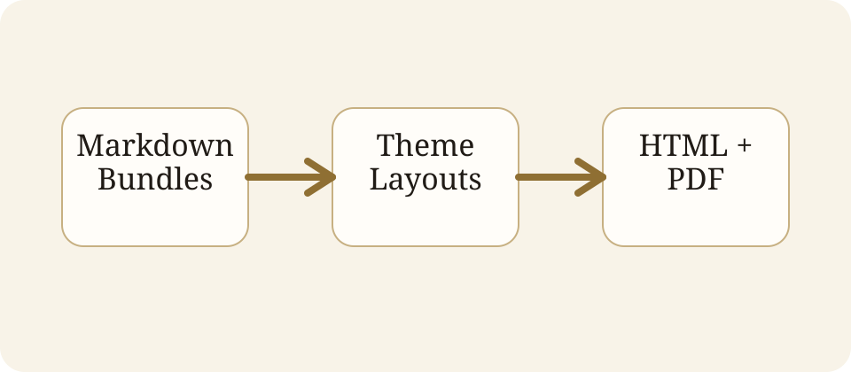

## Why this exists

- Markdown-first authoring
- Hugo-like project structure
- HTML-first output with PDF next


Theme-provided shortcodes make expressive slides possible without abandoning Markdown.




### Authoring

- Markdown
- Front matter
- Archetypes


### Output

- HTML first
- PDF next
- PPTX later





## Notes

Remind the audience that editable PPTX remains a later goal.
